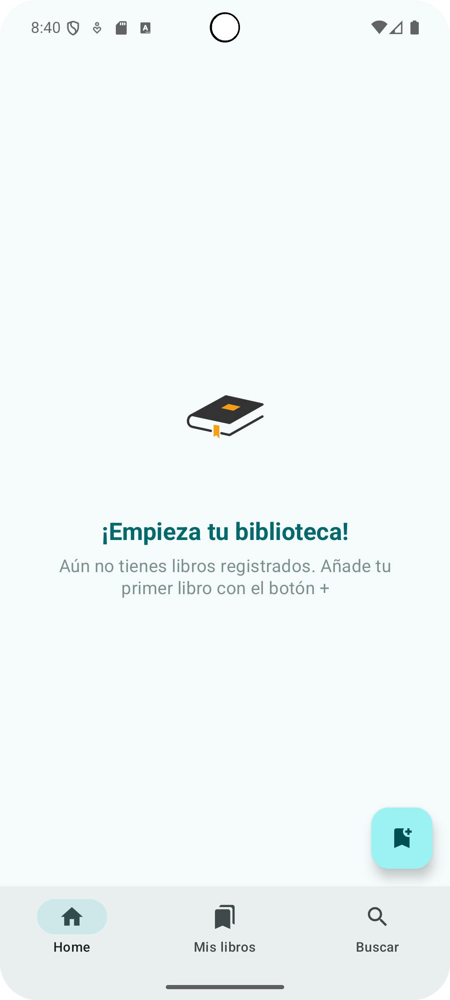
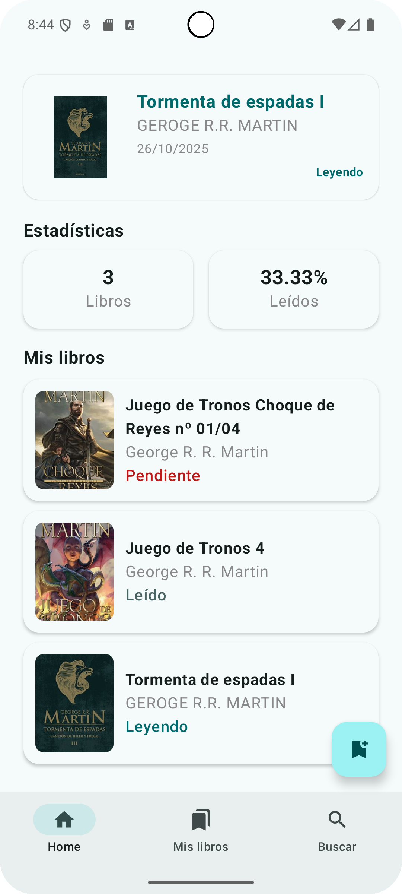
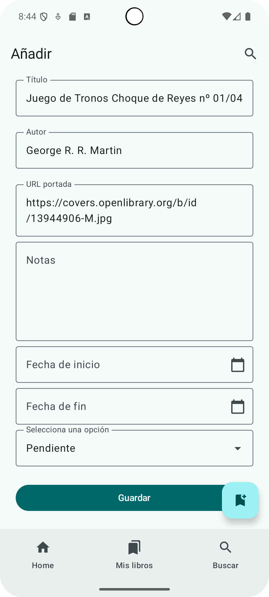
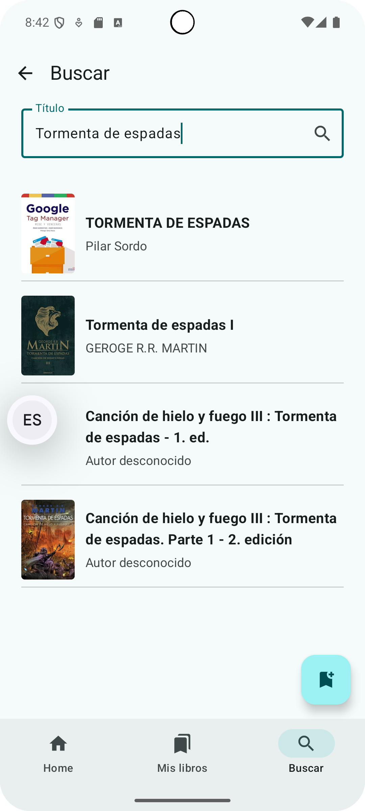

# 📚 Reading List

---

## 🧩 Descripción

**Reading List** es una aplicación Android para gestionar tus libros leídos, pendientes de leer y en progreso.  
Su objetivo es ofrecer una experiencia moderna y minimalista para organizar tus lecturas y llevar un control claro de tu progreso lector.

---

## ✨ Características principales

- 📖 **Gestión completa de libros**  
  Añade, edita y elimina libros fácilmente.

- 🏠 **Pantalla principal (Home)**  
  Muestra un resumen del estado de tus lecturas.

- 📚 **Pantalla de listado de libros**  
  Consulta todos los libros categorizados por estado (*leído*, *leyendo*, *pendiente*).

- 🔍 **Búsqueda de libros con Open Library API**
  Encuentra libros por título, autor o ISBN y añádelos directamente a tu biblioteca.

- 🧠 **Arquitectura moderna (MVVM)**  
  Basada en buenas prácticas de Android para garantizar escalabilidad y mantenibilidad.

- 💉 **Inyección de dependencias con Dagger Hilt**

- 🗄️ **Persistencia local con Room Database**
- 🌐 **Integración con API REST (Retrofit)**

- 🎨 **Interfaz construida en Jetpack Compose (Material 3)**

---

## 🛠️ Tecnologías utilizadas

| Categoría | Tecnología |
|------------|-------------|
| **Lenguaje** | [Kotlin](https://kotlinlang.org/) |
| **UI Toolkit** | [Jetpack Compose](https://developer.android.com/jetpack/compose) |
| **Arquitectura** | MVVM |
| **DI Framework** | [Dagger Hilt](https://dagger.dev/hilt/) |
| **Networking** | [Retrofit](https://square.github.io/retrofit/) + [OkHttp](https://square.github.io/okhttp/) |
| **Carga de imágenes** | [Coil](https://coil-kt.github.io/coil/) |
| **Base de datos local** | [Room](https://developer.android.com/training/data-storage/room) |
| **Navegación** | [Navigation Compose](https://developer.android.com/jetpack/compose/navigation) |
| **Asincronía** | Coroutines + Flow |
| **Estilo visual** | Material Design 3 |

---

## 📱 Capturas de pantalla

| Pantalla principal | Listado de libros | Nuevo libro | Buscar libro |
|--------------------|-------------------|-------------------|-------------------|
|  |  |  |  |

---

## 🧪 Estado del proyecto

🟢 **Versión actual:** `v3.0.0`  
🔧 Proyecto en desarrollo activo.  
Se planifican futuras actualizaciones para:
- Refinamiento visual.
---

## 📝 Licencia

Este proyecto está bajo la licencia **[MIT](LICENSE)**.  
Puedes usar, modificar y distribuir el código libremente, siempre que se mantenga la atribución correspondiente.

---

## 🤝 Contribuciones

¡Las contribuciones son bienvenidas!  
Si encuentras errores o deseas proponer mejoras, por favor abre un **issue** o envía un **pull request**.

---

## 👨‍💻 Autor

**Juan Gómez**  
Desarrollador Android  

---

> _“Un libro es un sueño que tienes en tus manos.” — Neil Gaiman_
